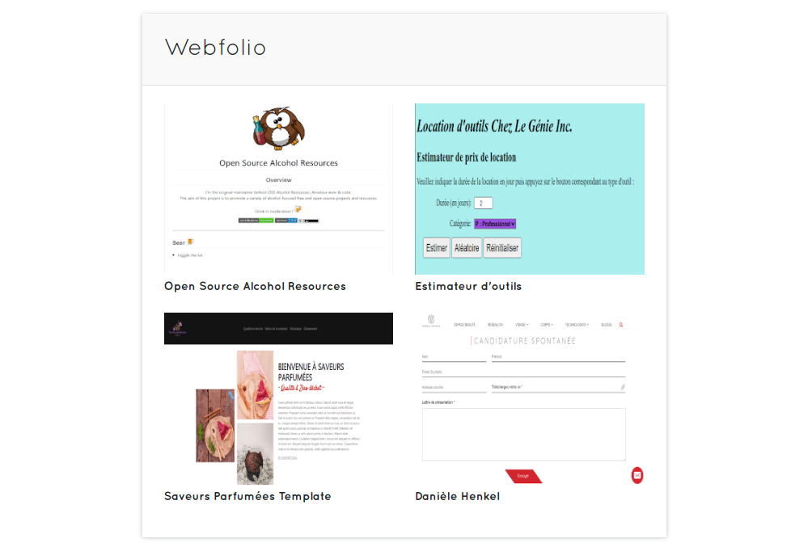

# Yannick Webfolio 

[](https://app.netlify.com/sites/reverent-shannon-39e93f/deploys)
[](https://github.com/ellerbrock/open-source-badge/)
[](https://opensource.org/licenses/MIT)




<br>

## Languages and tools
<a href="https://gridsome.org/" target="_blank"> </a>
<a href="https://vuejs.org/" target="_blank"> </a>
<a href="https://www.typescriptlang.org/" target="_blank"> </a>
<a href="https://getbootstrap.com" target="_blank"> </a>
<a href="https://sass-lang.com" target="_blank"> </a>
<a href="https://webpack.js.org" target="_blank"> </a>
<a href="https://www.linux.org/" target="_blank"> </a>

<br>

[Yannick Webfolio](https://) is my personal and professional webfolio that showcase my most recent work samples, real world problem solving skills and introduction about myself.

<br>

## Installation

I'm using MX Linux based on Debian.

<br>

1- After forking the repository, install Gridsome CLI globally :

```$ npm install --global @gridsome/cli```

<br>

2- Move into project folder and download a package and the project dependencies :

```$ cd yannick-webfolio && npm install```

<br>

3- Start local development server :

```$ gridsome develop```

<br>

You'll then be able to run the application locally at http://localhost:8080/ .

<br>

## Gridsome Plugins

* `@gridsome/transformer-remark` Markdown transformer for Gridsome with Remark.
* `@gridsome/source-filesystem` Transform files into content that can be fetched with GraphQL in your components.
* `@gridsome-plugin-purgecss` Purgecss to Gridsome project (non longer maintained).

<br>

## Contribution
Feel free to submit an [issue](https://github.com/YannAries/yannick-webfolio/issues) or a [pull request](https://github.com/YannAries/yannick-webfolio/pulls) if you want to contribute.

<br>

## Roadmap

- [ ] Optimize code following Google Lighthouse report
- [ ] Optimize security
- [ ] Internationalize routes in english
- [ ] Implement secure form submission
- [ ] Replace Bootstrap layouts with Bulma
- [ ] Integration testing