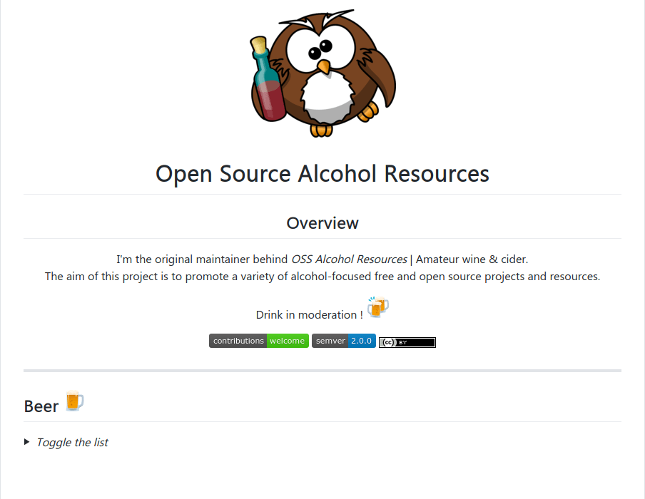

**OSS Alcohol Resources** est une liste de projets et de ressources libres et open source centrée sur les thèmes de l'alcool, que ce soit des API, des scripts, pages internet ainsi que des articles ou livres. 

<ins>Principales caractéristiques</ins> :
- Multi-platforme (bureau, mobile)
- Markdown

<ins>Rôle</ins> : Initiateur du projet

[Lien du projet Github](https://github.com/YannAries/OSS-alko-resources)

