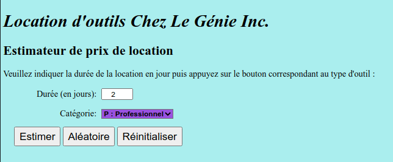
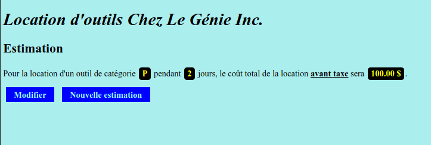

**Estimateur outils** est un estimateur de prix de location d'outils pour petite structure ou entrepreneur.

Fonctionnalités de base tels que choix de catégorie ou durée en jours avec la possibilité d'estimer le prix aléatoirement et de le réinitialiser à une durée de 1 jour.

<ins>Principales caractéristiques</ins> :
- Utilise Xampp sous Linux

<ins>Rôle</ins> : Développeur web généraliste

- Developpe les parties front-end et back-end en JavaScript et PHP avec Apache

[Lien du projet Github](https://github.com/YannAries/estimateur-outils)

