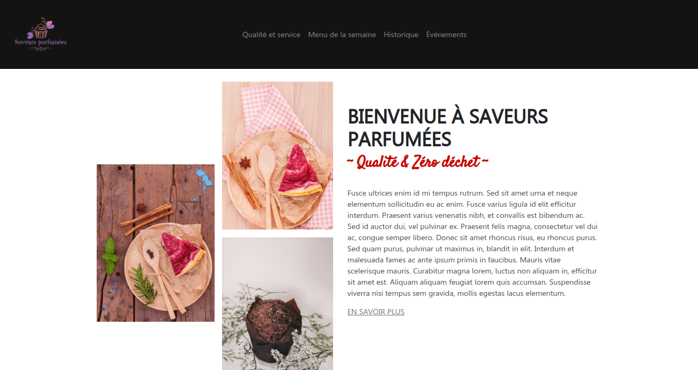

**Saveurs Parfumées - Coffee shop** est un template minimaliste, épuré et responsive adapté pour les travailleurs autonomes ou TPE officiant dans les domaines de l'hôtellerie et restauration.

<ins>Principales caractéristiques</ins> :
- Multi-platforme (bureau, mobile)
- Responsive, mobile-first

<ins>Rôle</ins> : Développeur web front-end

- Developpe la partie front-end en JavaScript et avec la librairie jQuery et framework Bootstrap 4.3.1

[Demo](https://yannaries.github.io/saveurs-parfumees-template/)

[Lien du projet Github](https://github.com/YannAries/saveurs-parfumees-template)

