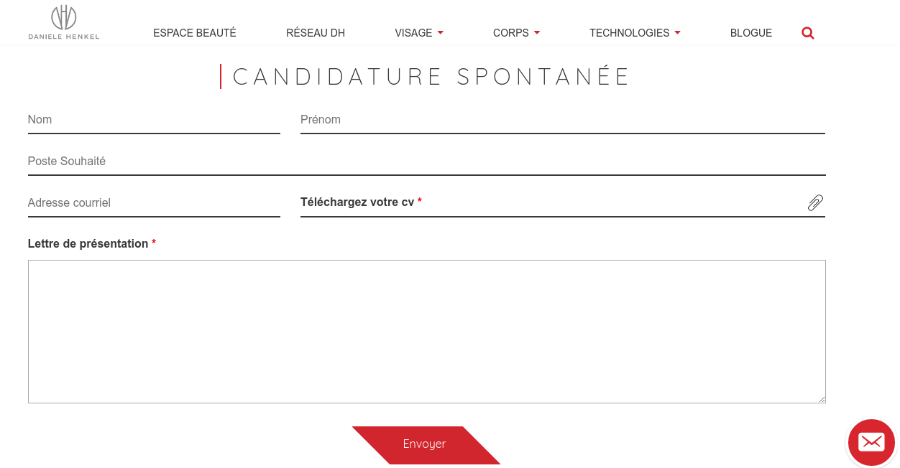

**L'Académie Danièle Henkel** propose des programmes de formation validés par un diplôme ou une certification, ciblant les professionnels du secteur médical-esthétique.

La page *Carrières* a été élaborée à l'aide d'un thème WordPress, personnalisé pour répondre aux besoins individuels du client. Le projet a duré environ deux semaines. L'équipe était composée de plusieurs développeurs de différents niveaux d'expérience, dont moi-même en tant que développeur web junior (stagiaire).

Danièle Henkel est une entrepreneuse montréalaise à succès dans le domaine de l'esthétisme.

<ins>Principales caractéristiques et technologies utilisées</ins> :
- Utilise macOS au bureau et Linux à distance en utilisant Git
- Plugin Ninja Forms sous WordPress
- PHP et JavaScript
- Préprocesseur Sass, boîte à outils gulp.js

<ins>Rôle</ins> : Développeur web généraliste à [Wink Stratégies](https://winkstrategies.com/)

- Participe au développement front-end et back-end
- Responsable de la résolution des problèmes côté client en s'assurant que toutes les entrées des utilisateurs soient validées avant qu'elles transitent au serveur.

[Lien archivé de la page](https://web.archive.org/web/20170326133452/http://www.danielehenkel.com/fr/carrieres/)

